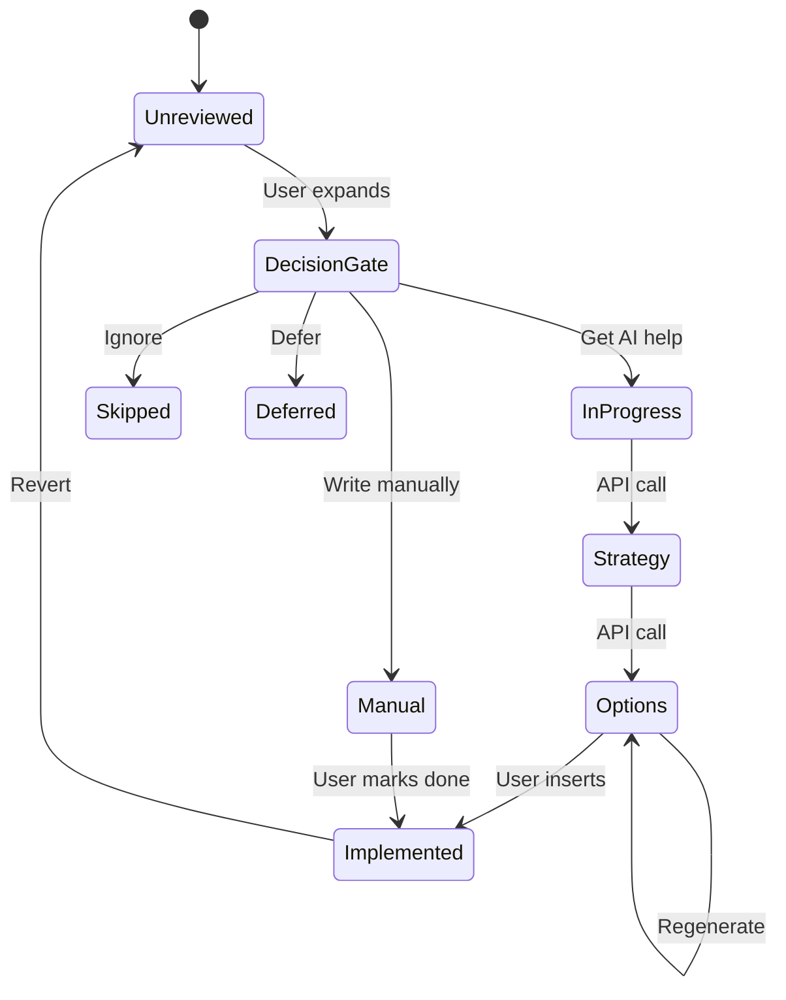
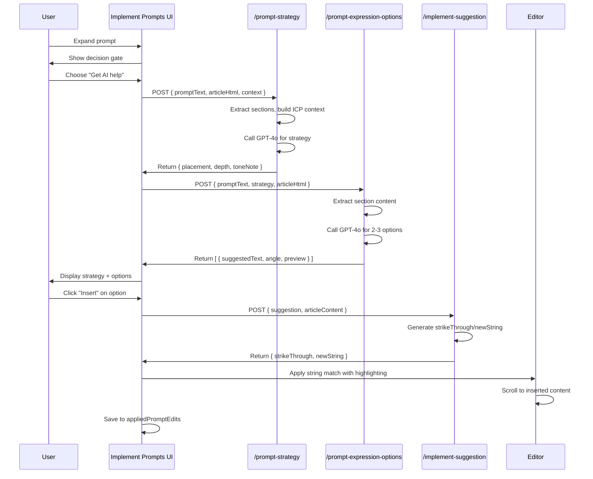

<!-- ARCHIVED: Original path was IMPLEMENT_PROMPTS_COMPLETE.md -->

# Implement Prompts Feature - Implementation Complete ✅

## Overview

The "Implement Prompts" feature has been successfully implemented following the design plan. This feature transforms the prompt implementation workflow from a passive score viewer into an active, user-led, AI-assisted tool that mirrors the "Implement Topics" pattern.

## What Was Implemented

### 1. Core Component (`libs/content-magic/rules/implementPrompts.js`)

**Complete rewrite** of the DetailedUI component (~1100 lines) with:

#### State Management
- Comprehensive state tracking for prompts, decisions, strategies, expression options, and applied edits
- Six distinct status types: Unreviewed, In Progress, Implemented, Manual, Skipped, Deferred
- Real-time UI updates with expandable/collapsible prompt items
- Progress tracking for high-impact prompts

#### User-Led Decision Gate (Mandatory Before AI)
Every prompt requires explicit user decision:
- ✨ **Get AI help** (recommended) - Triggers AI strategy + expression generation
- ✍️ **I'll write it manually** - Marks for manual handling
- ⊘ **Ignore for this page** - Intentional skip (persisted, not re-surfaced)
- ⏰ **Defer** - Decide later

#### AI-Assisted Workflow
1. **Strategy Generation**: AI determines placement, depth, and tone
   - Placement: Which section to augment
   - Depth: One sentence / short paragraph / subsection
   - Tone: Match existing article tone
   
2. **Expression Options**: 2-3 different phrasings generated
   - Each option has a distinct angle
   - Collapsed preview for easy scanning
   - Full text expansion on demand

3. **One-Click Implementation**: Insert with automatic highlighting
   - Per-option insertion (not bulk)
   - Visual highlighting with green background
   - Scroll-to-view on insertion
   - Revert capability per prompt

#### Status Badges & Filters
- Visual status indicators (icons + colors)
- Status filter dropdown
- "Show completed" toggle
- Smart filtering of completed items

#### Progress Tracking
- "High-impact prompts addressed: X/Y" counter
- Per-prompt status persistence
- Completion criteria: All high-impact prompts handled

### 2. API Routes

#### `/api/content-magic/prompt-strategy` (New)

**Purpose**: Generate strategic guidance for a single prompt

**Input**:
```json
{
  "promptId": "prompt-1",
  "promptText": "How do I choose a nanobody CRO?",
  "articleHtml": "<html>...</html>",
  "sections": [...],
  "campaignContext": {
    "icp": {...},
    "offer": "..."
  }
}
```

**Output**:
```json
{
  "strategy": {
    "placement": {
      "sectionHeading": "Services",
      "sectionKey": "services",
      "position": "within"
    },
    "depth": "short_paragraph",
    "toneNote": "Match existing professional clarity",
    "reasoning": "This section already discusses services, adding selection criteria fits naturally"
  }
}
```

**AI Model**: GPT-4o with forceJson
**Features**:
- Extracts sections from HTML
- Builds ICP context dynamically
- Returns structured strategy decision
- Validates required fields

#### `/api/content-magic/prompt-expression-options` (New)

**Purpose**: Generate 2-3 expression variants for a prompt

**Input**:
```json
{
  "promptId": "prompt-1",
  "promptText": "How do I choose a nanobody CRO?",
  "strategy": {...},
  "articleHtml": "<html>...</html>",
  "campaignContext": {...},
  "excludeAngles": ["Direct answer with example"]
}
```

**Output**:
```json
{
  "options": [
    {
      "suggestedText": "When choosing a CRO for nanobody development...",
      "insertionPoint": "comprehensive services that include",
      "preview": "When choosing a CRO for nanobody development, consider th...",
      "angle": "Direct answer with criteria list",
      "placement": {
        "sectionHeading": "Services",
        "insertionPoint": "comprehensive services that include"
      }
    },
    // ... 2-3 options total
  ]
}
```

**AI Model**: GPT-4o with forceJson
**Features**:
- Extracts relevant section content
- Generates 2-3 distinct angles
- Excludes previously used angles (for regeneration)
- Validates each option structure

### 3. Integration with Existing Systems

#### Uses Existing Patterns
- **`/api/content-magic/implement-suggestion`**: For actual text insertion (strikeThrough/newString)
- **`/api/content-magic/save-assets`**: For persisting all state
- **`WritingGuideContext`**: For article and editor access
- **`applyStringMatch`**: From Topics implementation for DOM manipulation

#### Data Storage (`article.assets`)
- `assets.prompts` - Original prompts (existing)
- `assets.GEOReport.rationale.prompts` - Evaluations (existing)
- `assets.promptDecisions` - User decisions (new)
- `assets.promptStrategies` - AI strategies (new)
- `assets.promptExpressionOptions` - Expression options (new)
- `assets.appliedPromptEdits` - Implementation records (new)

## Key Features Implemented

### ✅ User-Led, AI-Assisted Philosophy
- No bulk auto-generation
- Decision gate before every AI action
- User always in control

### ✅ Natural Language Focus
- Avoids "missing", "fail", "insufficient" language
- Prompts described as "reader questions"
- "Expression options" not "requirements"

### ✅ Status Tracking & Persistence
- Six distinct statuses
- Skipped prompts respected (not re-surfaced)
- Progress tied to high-impact prompts only

### ✅ Mirrors Topics Workflow
- Same right-side panel structure (320px)
- Similar expansion/collapse pattern
- Consistent button styling and interactions
- Parallel progress tracking

### ✅ Edge Cases Handled
1. **Prompt Partially Covered**: Shows "implicitly addressed" with "Take me there" link
2. **Article Edited After Suggestions**: Editor version tracking (ready for stale detection)
3. **User Edits Inserted Text**: Tracked via editor change events
4. **Multiple Prompts → Same Section**: Sequential handling recommended in UI
5. **No Good Insertion Point**: Error message with fallback to manual

## Technical Architecture

### Component Hierarchy
```
implementPrompts.js
├─ ListingUI (compact card)
└─ DetailedUI (right-side panel)
   ├─ Header
   │  ├─ Progress Summary
   │  └─ Filters
   ├─ Prompt List
   │  └─ PromptItem (per prompt)
   │     ├─ Status Badge
   │     ├─ Impact Badge
   │     ├─ Evaluation Status
   │     ├─ Decision Gate (if unreviewed)
   │     ├─ Strategy Guidance (if AI help chosen)
   │     ├─ Expression Options (2-3)
   │     │  └─ Insert / Regenerate actions
   │     └─ Implemented Status (if done)
   └─ Footer Progress
```

### State Flow


## API Flow Diagram



## Files Modified/Created

### Created
- ✅ `libs/content-magic/rules/implementPrompts.js` (complete rewrite, ~1100 lines)
- ✅ `app/api/content-magic/prompt-strategy/route.js` (new, ~200 lines)
- ✅ `app/api/content-magic/prompt-expression-options/route.js` (new, ~220 lines)

### No Changes Needed
- `libs/content-magic/rules/index.js` - Already registers implementPrompts
- `/api/content-magic/implement-suggestion` - Already supports prompts
- `/api/content-magic/save-assets` - Generic, works for all assets

## Testing Checklist

### Basic Functionality
- [ ] Prompts list loads from `assets.prompts`
- [ ] Evaluation scores display from `assets.GEOReport.rationale.prompts`
- [ ] Impact tier badges render correctly (High/Medium/Optional)
- [ ] Status badges show correct icons and colors

### Decision Gate
- [ ] Decision gate appears for unreviewed prompts
- [ ] All 4 options work: AI help, Manual, Ignore, Defer
- [ ] Decisions persist to `assets.promptDecisions`
- [ ] "Get AI help" triggers strategy generation

### AI Generation
- [ ] Strategy API returns valid placement/depth/tone
- [ ] Expression options API returns 2-3 variants
- [ ] Regeneration generates new angles (excludes previous)
- [ ] Loading states show during API calls

### Implementation
- [ ] "Insert" button calls implement-suggestion API
- [ ] Text insertion works with highlighting
- [ ] Scroll-to-view activates after insertion
- [ ] Applied edit saves to `assets.appliedPromptEdits`
- [ ] Prompt status updates to "Implemented"

### Revert
- [ ] "Revert" button appears for implemented prompts
- [ ] Revert removes highlighting and restores original text
- [ ] Applied edit removed from assets
- [ ] Status resets appropriately

### Filters & Progress
- [ ] Status filter dropdown filters correctly
- [ ] "Show completed" toggle works
- [ ] Progress counter accurate: "X/Y high-impact prompts"
- [ ] `is_complete` logic works (high-impact only)

### Edge Cases
- [ ] Partially covered prompts show "implicitly addressed"
- [ ] "Take me there" link scrolls to relevant content
- [ ] Manual/Skipped statuses display correctly
- [ ] Deferred prompts can be reopened
- [ ] Error messages appear for API failures

## Design Principles Verification

✅ **User-led, AI-assisted**: Decision gate before every AI action  
✅ **No bulk auto-generation**: Per-prompt opt-in required  
✅ **No mechanical SEO**: Language focuses on "reader questions" and "natural expression"  
✅ **Skipping respected**: Ignored prompts persisted, not re-surfaced  
✅ **Prompts as guidance**: "Expression options" not "requirements"  
✅ **Mirrors Topics workflow**: Same panel structure, similar state management  
✅ **Language-level focus**: Depth = sentence/paragraph, not section/page  

## Next Steps

1. **Testing**: Run through testing checklist above
2. **User Feedback**: Gather feedback on decision gate UX
3. **Monitoring**: Track AI prompt token usage for optimization
4. **Iteration**: Based on usage patterns, consider:
   - Caching strategy results for similar prompts
   - Batch strategy generation (with user approval)
   - Enhanced "Customize" flow for expression options

## Success Metrics

- **Adoption**: % of prompts where users choose "Get AI help" vs. manual
- **Quality**: User revert rate (lower = better AI suggestions)
- **Completion**: % of high-impact prompts addressed per article
- **Efficiency**: Time from decision to implementation

---

**Implementation Status**: ✅ Complete  
**Linter Errors**: None  
**All Todos**: Completed (8/8)  
**Ready for**: Testing & User Feedback
