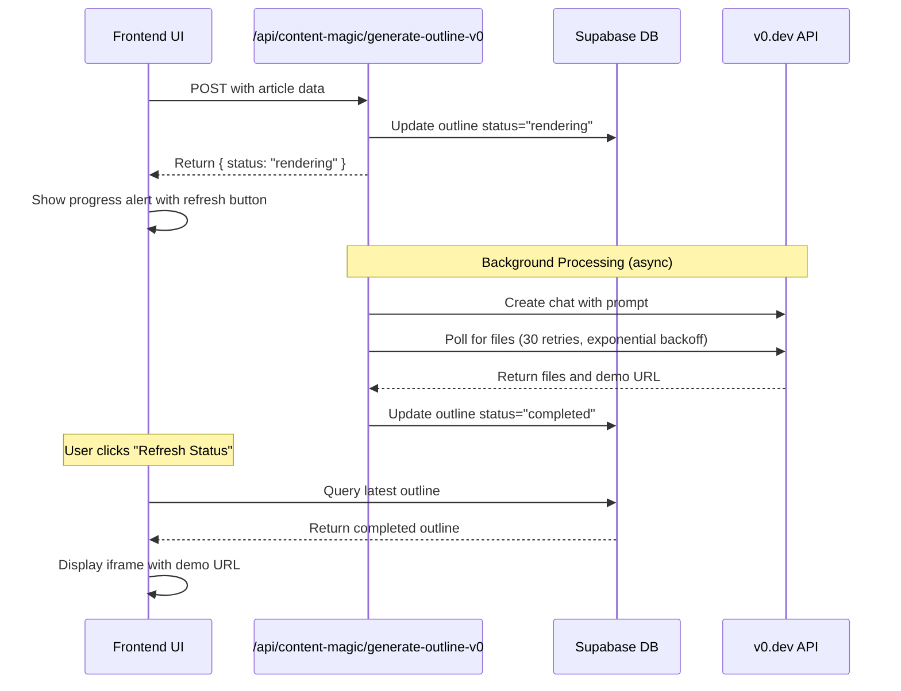

<!-- ARCHIVED: Original path was OUTLINE_V0_IMPLEMENTATION_GUIDE.md -->

# Create Outline with v0 - Implementation Guide

## Overview
Complete revamp of the Create Outline step to use v0 API for generating visual webpage outlines with async rendering, database persistence, and live preview.

## Implementation Summary

### ✅ Completed Tasks

1. **API Endpoint** - `app/api/content-magic/generate-outline-v0/route.js`
   - Async background processing (returns immediately to frontend)
   - Automatic status tracking in database
   - Polling with exponential backoff (30 retries for 3-minute timeout)
   - Comprehensive error handling
   - Support for both React and Single-page HTML output modes

2. **UI Revamp** - `libs/content-magic/rules/createOutline.js`
   - Full-width, single-column layout
   - Four main sections:
     1. Competitor Pages Selection (with checkboxes)
     2. Context Configuration (with dynamic asset checkboxes and textarea)
     3. Generation Settings (template type + output mode)
     4. Results Section (with iframe preview and files display)
   
3. **Dynamic Asset Generation**
   - Loop-based asset checkbox generation from `ASSET_CONFIGS`
   - One-way sync from checkboxes to textarea
   - Secure whitelist approach (no arbitrary property access)
   
4. **Async Rendering**
   - Database updated with `status: "rendering"` immediately on submit
   - User can leave page and return later
   - Auto-polling every 30 seconds while rendering
   - Manual refresh button to check status
   
5. **Output Modes**
   - **React Mode (default)**: Next.js/TypeScript components
   - **Single-page HTML Mode**: Pure HTML with inline Tailwind CSS

6. **Security Documentation**
   - Asset whitelisting documented in `.cursorrules`
   - Only approved asset keys can be accessed
   - Prevents injection vulnerabilities

## Database Schema

The `outline` JSONB column in `content_magic_articles` stores:

```json
{
  "status": "rendering" | "completed" | "failed",
  "chatId": "v0-chat-id",
  "demoUrl": "https://v0.dev/...",
  "files": [
    {
      "name": "page.tsx",
      "content": "...",
      "size": 1234
    }
  ],
  "startedAt": "2026-01-23T07:54:00Z",
  "completedAt": "2026-01-23T07:57:30Z",
  "generationTime": "3.2s",
  "prompt": "User prompt text...",
  "contextPrompt": "Context prompt text...",
  "selectedCompetitors": ["url1", "url2"],
  "selectedAssets": ["keywords", "topics", "prompts"],
  "outputMode": "react" | "single-page-html",
  "pollingAttempts": 25,
  "error": "Error message if failed"
}
```

## How to Test

### Prerequisites
1. Ensure `V0_API_KEY` is set in `.env.local`
2. Ensure article has some assets (keywords, topics, ICP, etc.)
3. Ensure article has competitor pages if you want to test that feature

### Test Steps

1. **Navigate to Content Magic**
   - Open an article in Content Magic
   - Click on "Create Outline" rule

2. **Test Competitor Selection**
   - Verify competitor pages are displayed (if available)
   - Toggle some on/off
   - Verify all are selected by default

3. **Test Asset Checkboxes**
   - Verify available assets show as checkboxes
   - Toggle some assets on/off
   - Verify context textarea updates automatically
   - Verify manual edits to textarea persist (one-way sync)

4. **Test Template Selection**
   - Change template type (Based on Competitors, Landing Page, Informational)
   - Verify user prompt updates accordingly

5. **Test Output Mode**
   - Switch between React and Single-page HTML
   - Verify description text updates

6. **Test Generation (React Mode)**
   - Click "Generate Outline with v0"
   - Verify button changes to "Submitting..."
   - Verify "Outline Generation In Progress" alert appears
   - Verify started timestamp is displayed
   - Wait a few seconds, click "Refresh Status"
   - If still rendering, wait 3-10 minutes total
   - Once complete, verify:
     - Green "Completed" badge appears
     - Iframe loads with demo URL
     - "Open in New Tab" button works
     - Files section shows generated files

7. **Test Generation (HTML Mode)**
   - Change output mode to "Single Page HTML"
   - Click generate again
   - Verify it generates a single HTML file with inline styles

8. **Test Persistence**
   - Leave the outline step and return to it
   - Verify previous outline still displays
   - Verify previous settings are restored

9. **Test Error Handling**
   - Try generating with no V0_API_KEY (should show error)
   - Verify error message is displayed clearly

10. **Test Auto-polling**
    - Start a generation
    - Leave the page for 30+ seconds
    - Return and verify status has updated automatically

### Expected Results

✅ All sections render without errors
✅ Checkboxes sync to textarea (one-way)
✅ Generation starts immediately and shows progress
✅ User can leave and return to check status
✅ Completed outline displays in iframe
✅ Files are accessible in collapsible section
✅ Settings persist on page reload
✅ Both output modes work correctly

## API Flow



## File Structure

```
app/
  api/
    content-magic/
      generate-outline-v0/
        route.js (NEW - API endpoint with async processing)

libs/
  content-magic/
    rules/
      createOutline.js (UPDATED - Complete UI revamp)

.cursorrules (UPDATED - Added security documentation)
```

## Key Features

### 1. Async Background Processing
The API endpoint returns immediately with `status: "rendering"`, then continues processing in the background. This prevents timeout issues and allows users to leave the page.

### 2. Dynamic Asset Configuration
Asset checkboxes are generated from `ASSET_CONFIGS`, which defines:
- Asset key (for identification)
- Label (for display)
- Path (dot notation to access from article)
- Format function (how to convert to prompt text)

This approach ensures:
- Only whitelisted assets are accessible
- Consistent formatting
- Easy to add new assets
- Security through explicit configuration

### 3. One-way Sync
Checkboxes update the textarea, but textarea edits don't update checkboxes. This allows:
- Quick start with pre-filled context
- Full manual control when needed
- No confusing bidirectional sync issues

### 4. Output Mode Flexibility
Users can choose between:
- **React**: For modern web apps with components
- **HTML**: For static sites or simple landing pages

The prompt is adjusted automatically based on selection.

### 5. Status Persistence
All outline data is saved to the database, including:
- Current status (rendering/completed/failed)
- User selections (competitors, assets, mode)
- Generated files and preview URL
- Timestamps and performance metrics

This enables:
- Page reload without data loss
- Historical tracking
- Debugging and analytics

## Troubleshooting

### "V0_API_KEY not configured"
- Add `V0_API_KEY=your-key` to `.env.local`
- Get key from https://v0.dev/chat/settings/keys
- Restart dev server

### "No files generated"
- Check server logs for detailed error messages
- Verify v0.dev API is accessible
- Try with a simpler prompt
- Check if there are any network issues

### Outline stays in "rendering" forever
- Check server logs for errors
- Click "Refresh Status" to check latest from DB
- Verify v0 API key is valid
- Generation can take 3-10 minutes for complex requests

### Context textarea is empty
- Verify article has assets (keywords, topics, ICP)
- Check asset checkboxes are selected
- Try toggling checkboxes off and on

### Iframe not loading
- Verify `demoUrl` is present in the result
- Check browser console for iframe errors
- Try opening in new tab
- v0.dev preview URLs may have short expiry times

## Security Notes

### Asset Whitelisting
The implementation uses a strict whitelist approach for asset access:

```javascript
// Only these assets can be accessed
const APPROVED_ASSETS = [
  'main_keyword',
  'original_vision',
  'icp',
  'offer',
  'keywords',
  'topics',
  'prompts'
];
```

**Why this matters:**
- Prevents accessing sensitive or unintended data
- Protects against injection attacks
- Makes data flow explicit and auditable
- Ensures only business-relevant data reaches external APIs

**Implementation:**
All asset access goes through the `ASSET_CONFIGS` array, which defines exactly which properties can be accessed and how they should be formatted. Direct property access from user input is never allowed.

## Performance Considerations

### Generation Time
- Expected: 3-10 minutes
- Varies based on prompt complexity and v0.dev load
- Exponential backoff prevents overwhelming v0 API

### Database Updates
- Three updates per generation:
  1. Initial: status="rendering"
  2. On completion: status="completed" with all data
  3. On failure: status="failed" with error

### Auto-polling
- Polls every 30 seconds when status is "rendering"
- Stops when status becomes "completed" or "failed"
- User can manually refresh at any time

## Future Enhancements

Potential improvements (not in current scope):
- Email notification when generation completes
- History of past generations
- Ability to regenerate with modified settings
- Export to various formats (markdown, JSON, etc.)
- A/B testing different outlines
- Integration with article editor for direct import

## Support

For issues or questions:
1. Check server logs first (most errors are logged)
2. Verify all prerequisites are met
3. Test with a simple prompt to isolate issues
4. Review this guide's troubleshooting section
