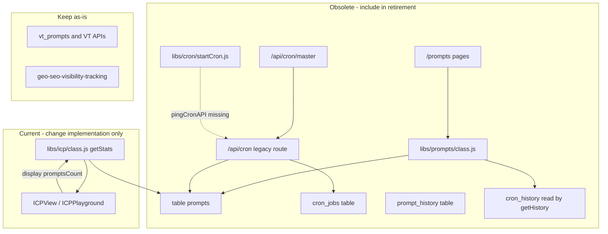

# Retire Old Prompts Module – Deactivation Plan (Updated)

## Scope

- **Legacy table:** `prompts` (Supabase `public.prompts`). **Keep:** `vt_prompts` and all VT APIs.
- **Legacy app module:** Routes under `/prompts` and the library that backs them (`libs/prompts`).
- **Obsolete code:** Any code that **only** serves the old prompts table/module or the old cron job flow; if it is also used by current non-obsolete features, it is listed as “used by current code” and we only change the implementation (e.g. stop reading `prompts`).

---

## 1. Table "prompts" – where it’s used and if callers are current

| Location | Usage | Used by current code? |
|----------|--------|------------------------|
| [libs/prompts/class.js](libs/prompts/class.js) | `this.table = 'prompts'`; all CRUD, getHistory (reads `cron_history`), searchText, bulkUpdate, getStats, export/import. | **No.** Only used by `/prompts` UI components (see section 2). |
| [app/api/cron/route.js](app/api/cron/route.js) | `supabase.from('prompts').update(...)` (action `test`); `cron.monkey.read('prompts', ...)` (action `test1`); also calls `cron.addNewTasks('prompt')`, `cron.getTasks`, `cron.reportResults`, `cron.archiveFinishedTasks` (these methods **do not exist** on the current [libs/cron/class.js](libs/cron/class.js), so this flow is already broken). | **No.** Legacy cron API; not used by Vercel cron (which uses `/api/cron/trigger`). |
| [libs/icp/class.js](libs/icp/class.js) | `getStats(id)`: `this.monkey.read('prompts', [{ operator: 'eq', args: ['icp_id', id] }])` for `promptsCount` and last-used. | **Yes.** [app/(private)/icps/components/ICPView.js](app/(private)/icps/components/ICPView.js) and [ICPPlayground.js](app/(private)/icps/components/ICPPlayground.js) call `icp.getStats()`. ICPView shows “Linked Prompts” / `stats.promptsCount`. **Action:** Change `getStats()` to stop reading `prompts` (e.g. return `promptsCount: 0` or remove the field and update UI). |
| [app/api/monkey/route.js](app/api/monkey/route.js) | `whiteListTables` includes `'prompts'` and `'prompt_history'`. | **Unclear.** Only needed if some client still calls the monkey API with `table: 'prompts'`. That would be the old `/prompts` UI (via libs/prompts → monkey). So once the prompts module is retired, these can be removed from the whitelist. |

**Related table – `cron_history`:** Read only in [libs/prompts/class.js](libs/prompts/class.js) `getHistory()` for prompt execution history. If the old prompts module is fully retired, this dependency goes away; decide separately whether to keep/drop the `cron_history` table.

---

## 2. /prompts module – routes and components (all obsolete)

All of these are used **only** for the legacy prompts feature. No other part of the app depends on them.

| Path | Purpose |
|------|--------|
| [app/(private)/prompts/[[...slug]]/page.js](app/(private)/prompts/[[...slug]]/page.js) | Catch-all: `/prompts`, `/prompts/new`, `/prompts/playground`, `/prompts/[id]`, `/prompts/[id]/edit`. |
| [app/(private)/prompts/components/PromptsList.js](app/(private)/prompts/components/PromptsList.js) | Uses `initPrompts()` from `@/libs/prompts/class`; links to `/prompts/new`, `/prompts/[id]`, `/prompts/[id]/edit`. |
| [app/(private)/prompts/components/PromptsForm.js](app/(private)/prompts/components/PromptsForm.js) | Create/edit form; uses `initPrompts()`; redirects/links to `/prompts`. |
| [app/(private)/prompts/components/PromptsView.js](app/(private)/prompts/components/PromptsView.js) | View single prompt; uses `initPrompts()`; loads history from `cron_history`; links to `/prompts`, `/prompts/[id]/edit`. |
| [app/(private)/prompts/components/PromptsReport.js](app/(private)/prompts/components/PromptsReport.js) | Uses `initPrompts()`. |
| [app/(private)/prompts/components/PromptsEdit.js](app/(private)/prompts/components/PromptsEdit.js) | Edit wrapper. |
| [app/(private)/prompts/components/PromptsNew.js](app/(private)/prompts/components/PromptsNew.js) | New prompt wrapper. |
| [app/(private)/prompts/components/PromptsPlayground.js](app/(private)/prompts/components/PromptsPlayground.js) | Playground wrapper. |
| [libs/prompts/class.js](libs/prompts/class.js) | Prompts service (table `prompts`, monkey, `cron_history`). **Only** callers are the above components and the legacy cron/monkey/ICP paths already listed. |

---

## 3. Navigation and onboarding

| Location | Change | Used by current code? |
|----------|--------|------------------------|
| [app/(private)/layout.js](app/(private)/layout.js) | Sidebar item `{ name: 'Prompts', href: '/prompts', ... }` (line 45, `devOnly: true`). | **No.** Remove or comment out. |
| [app/(private)/dashboard/components/OnboardingChecklist.js](app/(private)/dashboard/components/OnboardingChecklist.js) | Step “Add prompts to track” with `link: "/prompts"` and `hasPrompt` prop. | **Only if dashboard still renders OnboardingChecklist.** In the main app, OnboardingChecklist is not imported in [app/(private)/dashboard/page.js](app/(private)/dashboard/page.js); it appears in `base44_generated_code` only. Update or remove the step (e.g. point to VT project settings or remove). |

---

## 4. Obsolete code that only serves the old prompts/cron flow

These are **not** used by the current production cron (Vercel uses `/api/cron/trigger` only) or by any other active feature.

### 4.1 Legacy cron API and master

| Location | Purpose | Why obsolete |
|----------|--------|---------------|
| [app/api/cron/route.js](app/api/cron/route.js) | POST handler for actions: `test`, `test1`, `getTasks`, `processTasksLocal`, `reportResults`, `manageTasks`, `reset`, `deleteAll`. Uses `cron.cronSecret`, `cron.monkey`, `cron.addNewTasks`, `cron.getTasks`, etc. | **Current [libs/cron/class.js](libs/cron/class.js) does not define `cronSecret`, `monkey`, `addNewTasks`, `getTasks`, `reportResults`, `archiveFinishedTasks`, or `requeueStuckTasks`.** So this route is already broken for the old flow. Not in [vercel.json](vercel.json) crons (only `/api/cron/trigger` is). |
| [app/api/cron/master/route.js](app/api/cron/master/route.js) | GET: calls `/api/cron` with `action: "manageTasks"` then `action: "processTasksLocal"` (when `CRON_LOCAL_WORKER=true`). | **Obsolete.** Depends on the legacy `/api/cron` flow above. Not in vercel.json. |

### 4.2 Legacy cron runner script

| Location | Purpose | Why obsolete |
|----------|--------|---------------|
| [libs/cron/startCron.js](libs/cron/startCron.js) | Node script: `schedule.schedule(...)` then `await cron.pingCronAPI()`. | **Obsolete.** [libs/cron/class.js](libs/cron/class.js) has no `pingCronAPI` method, so this script would throw. [package.json](package.json) script `"cj:cron": "node libs/cron/startCron.js"` is legacy. |

### 4.3 Old cron tables and monkey whitelist

| Item | Used by | Obsolete? |
|------|--------|-----------|
| Table `cron_jobs` | Only [app/api/cron/route.js](app/api/cron/route.js) (action `reset`: read/update `cron_jobs`; action `manageTasks`: comments reference adding from prompts to cron_jobs). | **Yes** with the legacy route. Current VT flow uses `vt_jobs`, not `cron_jobs`. |
| Table `prompt_history` | Only in [app/api/monkey/route.js](app/api/monkey/route.js) whitelist. No other code reference found. | **Yes** for retirement; remove from whitelist when prompts module is retired. |

---

## 5. What to leave as-is (VT and content-magic)

- **VT prompts:** All uses of **vt_prompts** and **/api/visibility_tracker/prompts** (e.g. geo-seo-visibility-tracking project/settings, cron/trigger, worker, scheduler) stay.
- **Content-Magic “prompts”:** Article assets (e.g. [libs/content-magic/rules/researchPrompts.js](libs/content-magic/rules/researchPrompts.js), [app/api/content-magic/prompts/](app/api/content-magic/prompts/)) are **unrelated** to the `prompts` table. The function `getPromptTypeFromPrompts()` in researchPrompts.js reads from `existingPrompts` (article/context assets), not the DB table. No change.

---

## 6. Optional / reference-only

- **base44_generated_code/** (e.g. PromptList.js, Dashboard.js, IcpList.js, Quest.json): References to “prompts” or query keys; include in cleanup only if you still use that scaffold.
- **libs/reference-for-ai/** (e.g. `database_references` quests `module = 'prompts'`, entities/Quest.json): Update or remove the `prompts` module reference when retiring.
- **Quests:** If any quests use `module = 'prompts'`, migrate or deprecate.
- **docs/SCHEDULE_JOBS_DEMO_PLAN.md:** Refers to the old `prompts` table and cron_jobs; consider archiving or updating to VT-only.

---

## 7. Suggested deactivation order

1. **ICP getStats (used by current code):** In [libs/icp/class.js](libs/icp/class.js), change `getStats()` to stop reading the `prompts` table (e.g. return `promptsCount: 0` and compute `lastUsed` without prompts, or drop `promptsCount` and update [ICPView.js](app/(private)/icps/components/ICPView.js) to hide or relabel “Linked Prompts”).
2. **UI and nav:** Remove/comment the Prompts sidebar item in [app/(private)/layout.js](app/(private)/layout.js). Update or remove the “Add prompts to track” step in [app/(private)/dashboard/components/OnboardingChecklist.js](app/(private)/dashboard/components/OnboardingChecklist.js).
3. **/prompts routes:** Remove or replace [app/(private)/prompts/](app/(private)/prompts/) (e.g. redirect to geo-seo-visibility-tracking or 404).
4. **Legacy cron API:** In [app/api/cron/route.js](app/api/cron/route.js), remove or guard the legacy actions that touch `prompts` or the old flow (`test`, `test1`, `manageTasks`, `getTasks`, `processTasksLocal`, `reportResults`) so they are no longer callable (or return a clear “deprecated” response). Leave any actions that are still needed (if none, consider deprecating the whole route).
5. **Cron master and startCron:** Remove or deprecate [app/api/cron/master/route.js](app/api/cron/master/route.js). Remove or repurpose [libs/cron/startCron.js](libs/cron/startCron.js) and the `cj:cron` script in package.json if unused.
6. **Monkey whitelist:** In [app/api/monkey/route.js](app/api/monkey/route.js), remove `'prompts'` and `'prompt_history'` from `whiteListTables` once no callers remain.
7. **Library:** Delete or archive [libs/prompts/class.js](libs/prompts/class.js) once no callers remain.
8. **Database:** After code is fully deactivated and data is backed up, drop or rename the `prompts` table (and optionally `prompt_history`, `cron_jobs`) via a migration if desired.

---

## 8. Summary diagram

---

This plan lists every identified use of the old `prompts` table and `/prompts` module, marks whether each is used by current non-obsolete code, and includes obsolete callers (legacy cron route, cron master, startCron, cron_jobs, prompt_history) so they can be deactivated together.
